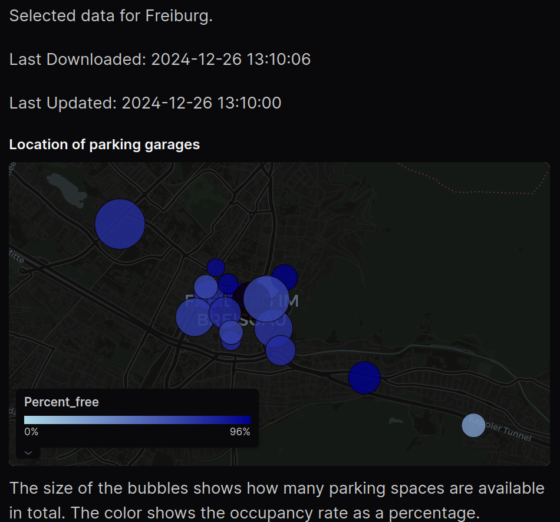
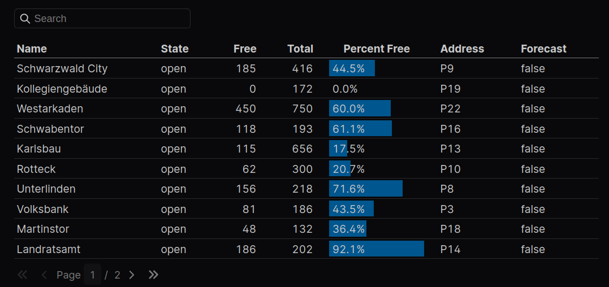
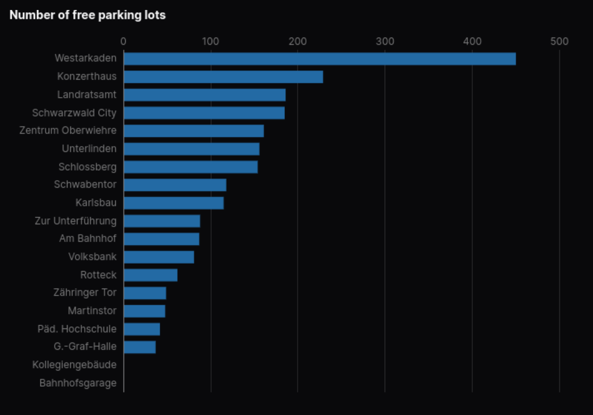

# Parking Garages

The [PakenDD-API](https://parkendd.de/index.html) API provides data on the occupancy of parking garages in various cities in Europe. The data is visualized with this [Evidence](https://www.evidence.dev) web app. Visit https://parkinggarage.evidence.app/ to see the result.

